# 美剧单词学习助手软件设计说明书

**软件名称：** 美剧单词学习助手系统
**版本号：** V1.0
**文档说明：** 本文档最终打印时，页码位于每页右上角

---

## 1. 软件概述

### 1.1 软件背景与用途

美剧单词学习助手系统是一款面向英语学习者的智能化词汇学习管理软件，专门解决用户在观看美剧过程中遇到生词的记录、学习和复习痛点。传统的单词学习工具往往需要用户手动记录、添加和管理单词，学习摩擦大、效率低。本软件创新性地采用"即查即记"的零摩擦学习理念，用户只需查询单词即可自动纳入个人单词库并生成智能学习计划，无需任何额外操作。

本软件适用于以下场景：
- 英语学习者观看美剧、电影时的即时单词查询与记录
- 基于科学记忆曲线的单词复习与掌握度跟踪
- 通过AI智能助手进行单词用法深度学习
- 个人单词库的统一管理和数据导出

### 1.2 开发目标与特点

**核心开发目标：**
1. 实现零摩擦的单词记录机制，查询即自动保存并创建学习计划
2. 基于艾宾浩斯遗忘曲线实现科学的间隔重复学习算法
3. 集成AI大语言模型提供单词用法解析、例句生成和记忆技巧
4. 支持多用户独立数据隔离和安全的身份认证机制
5. 提供完善的单词库管理功能，包括搜索、筛选、排序和导出

**技术特点：**
- **前后端分离架构：** 前端使用Vue.js 3框架，后端使用Flask轻量级Web框架
- **RESTful API设计：** 标准化的接口设计，支持跨平台扩展
- **智能学习算法：** 实现艾宾浩斯记忆曲线的5级掌握度管理
- **AI深度集成：** 调用iFlow API（Qwen3-Coder-Plus模型）提供智能辅助
- **数据持久化：** 采用SQLite轻量级关系数据库，支持数据导出
- **JWT认证机制：** 无状态的Token认证，安全可靠
- **现代化UI设计：** Bento Grid布局和Glassmorphism视觉风格

### 1.3 运行环境与技术架构

**后端运行环境：**
- 操作系统：Windows / Linux / macOS
- Python版本：3.8及以上
- 核心框架：Flask 3.0.0
- 数据库：SQLite 3
- 部署方式：Gunicorn WSGI服务器（生产环境）/ Flask内置服务器（开发环境）

**前端运行环境：**
- 浏览器：Chrome 90+、Firefox 88+、Safari 14+、Edge 90+
- 构建工具：Vite 5.1.6
- UI框架：Vue.js 3.4.21 + Tailwind CSS 3.4.1
- 状态管理：Pinia 2.1.7
- 路由管理：Vue Router 4.3.0

**外部依赖服务：**
- 有道翻译API：用于英译中翻译服务
- iFlow API：基于Qwen3-Coder-Plus的AI智能助手服务

**技术架构概述：**
本软件采用标准的B/S（Browser/Server）架构和前后端分离设计模式。前端通过HTTP/HTTPS协议与后端RESTful API进行JSON格式的数据交互。后端采用经典的MVC三层架构变体（Model-Service-Route），数据持久层使用SQLAlchemy ORM框架实现数据库操作的对象化封装。用户身份认证采用JWT（JSON Web Token）无状态认证机制，实现了多用户数据完全隔离。

---

## 2. 系统架构图

### 2.1 整体架构

系统采用前后端分离的三层架构设计，包含表现层、业务逻辑层和数据持久层。前端与后端通过RESTful API进行通信，后端集成第三方翻译服务和AI服务，所有用户数据存储在SQLite数据库中。

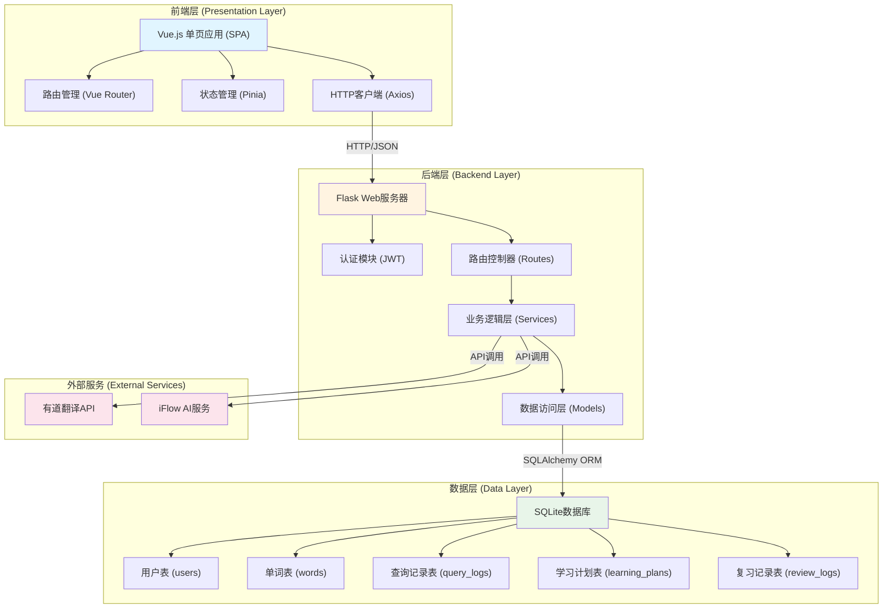

**图2-1：系统整体架构图**

### 2.2 技术栈架构

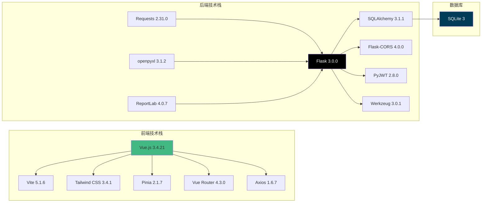

**图2-2：技术栈架构图**

---

## 3. 功能模块设计

### 3.1 功能模块总览

系统划分为六个核心功能模块，分别负责用户认证、单词查询与管理、学习计划管理、AI智能助手、统计分析和数据导出。各模块之间通过数据库表关联和服务调用实现协同工作。

```mermaid
graph TD
    A["美剧单词学习助手系统"]

    A --> B["用户认证模块"]
    A --> C["单词查询与管理模块"]
    A --> D["学习计划模块"]
    A --> E["AI智能助手模块"]
    A --> F["统计分析模块"]
    A --> G["数据导出模块"]

    B --> B1["用户注册"]
    B --> B2["用户登录"]
    B --> B3["JWT令牌生成"]
    B --> B4["身份验证装饰器"]

    C --> C1["单词查询 (查询即记录)"]
    C --> C2["单词库列表 (分页/搜索/筛选)"]
    C --> C3["单词详情查看"]
    C --> C4["单词信息更新"]
    C --> C5["历史查询记录"]

    D --> D1["自动创建学习计划"]
    D --> D2["今日待复习单词"]
    D --> D3["提交复习结果"]
    D --> D4["艾宾浩斯曲线计算"]
    D --> D5["掌握度等级管理"]

    E --> E1["单词用法解析"]
    E --> E2["智能例句生成"]
    E --> E3["近义词辨析"]
    E --> E4["记忆口诀生成"]

    F --> F1["学习统计概览"]
    F --> F2["剧集单词排行"]
    F --> F3["复习记录统计"]

    G --> G1["Excel格式导出"]
    G --> G2["PDF格式导出"]
    G --> G3["导出功能检测"]

    style A fill:#ff6b6b,color:#ffffff
    style B fill:#4ecdc4
    style C fill:#45b7d1
    style D fill:#96ceb4
    style E fill:#ffeaa7
    style F fill:#dfe6e9
    style G fill:#a29bfe
```

**图3-1：功能模块总览图**

### 3.2 核心功能模块详细设计

#### 3.2.1 用户认证模块

**功能描述：**
负责用户注册、登录、身份验证和令牌管理。采用JWT（JSON Web Token）无状态认证机制，令牌有效期为24小时。密码采用Werkzeug库的SHA256哈希算法加密存储。

**核心类与方法：**
- `User` 模型类：用户数据模型，包含 `set_password()` 和 `check_password()` 方法
- `generate_token(user_id)` 函数：生成JWT令牌
- `verify_token(token)` 函数：验证JWT令牌有效性
- `login_required` 装饰器：保护需要认证的API端点

**验证流程：**
1. 用户提交用户名/邮箱和密码
2. 后端验证用户名长度（3-80字符）、邮箱格式、密码强度（至少6字符）
3. 检查用户名和邮箱唯一性
4. 密码哈希存储，生成JWT令牌返回给前端
5. 前端将令牌存储在localStorage，后续请求在Header中携带

#### 3.2.2 单词查询与管理模块

**功能描述：**
实现单词的即查即记功能。用户查询单词时，系统首先检查数据库是否已存在该单词，如果存在则直接返回；如果不存在，则调用有道翻译API获取释义、音标、例句等信息，保存到数据库后返回。同时自动创建查询记录和学习计划，无需用户额外操作。

**核心功能：**
- **单词查询 (POST /api/words/query)：** 查询单词并自动记录，支持关联剧名、剧集和情境备注
- **单词列表 (GET /api/words/list)：** 分页展示用户查询过的所有单词，支持按时间/频率/掌握度排序，支持按剧集和掌握等级筛选
- **单词搜索 (GET /api/words/search)：** 模糊搜索用户历史单词
- **单词详情 (GET /api/words/:id)：** 获取单词完整信息，包括查询历史和学习计划
- **单词更新 (PUT /api/words/:id)：** 更新单词的例句、音标等信息

**关键业务逻辑：**
```python
# 查询单词核心流程（伪代码）
def query_word(word_text, user_id):
    # 1. 检查单词是否已存在
    word = database.query(Word).filter(word=word_text).first()

    if not word:
        # 2. 调用翻译API获取释义
        translation_result = translation_service.translate(word_text)

        # 3. 创建单词记录
        word = Word(
            word=word_text,
            phonetic=translation_result.phonetic,
            translation=translation_result.translation,
            examples=translation_result.examples
        )
        database.save(word)

    # 4. 检查是否已有学习计划
    plan = database.query(LearningPlan).filter(user_id, word.id).first()
    if not plan:
        # 5. 自动创建学习计划
        plan = LearningPlan(user_id=user_id, word_id=word.id)
        database.save(plan)

    # 6. 创建查询记录
    query_log = QueryLog(
        user_id=user_id,
        word_id=word.id,
        tv_show=tv_show,
        season_episode=season_episode
    )
    database.save(query_log)

    return word
```

#### 3.2.3 学习计划模块

**功能描述：**
基于艾宾浩斯遗忘曲线实现智能间隔重复学习算法。系统将单词掌握度划分为0-5六个等级，每个等级对应不同的复习间隔时间。用户提交复习结果后，系统根据正确与否动态调整掌握度和下次复习时间。

**艾宾浩斯间隔设置：**
- Level 0 → 1天后复习
- Level 1 → 2天后复习
- Level 2 → 4天后复习
- Level 3 → 7天后复习
- Level 4 → 15天后复习
- Level 5 → 已完全掌握，无需复习

**核心算法：**
```python
REVIEW_INTERVALS = [1, 2, 4, 7, 15]  # 天数

def calculate_next_review(is_correct):
    if is_correct:
        # 答对：提升掌握度
        mastery_level = min(mastery_level + 1, 5)
        if mastery_level >= 5:
            is_mastered = True
            next_review = None  # 不再需要复习
        else:
            interval = REVIEW_INTERVALS[mastery_level]
            next_review = now + timedelta(days=interval)
    else:
        # 答错：降低掌握度，重新开始
        mastery_level = max(mastery_level - 1, 0)
        is_mastered = False
        interval = REVIEW_INTERVALS[0]
        next_review = now + timedelta(days=interval)

    review_count += 1
    last_review = now
```

**核心功能：**
- **今日待复习 (GET /api/learning/today)：** 查询当前时间需要复习且未掌握的单词列表
- **学习计划概览 (GET /api/learning/plan)：** 统计总单词数、已掌握数、学习中数量、待复习数量
- **提交复习结果 (POST /api/learning/review)：** 提交单词复习结果（正确/错误），系统自动计算下次复习时间并更新掌握度

#### 3.2.4 AI智能助手模块

**功能描述：**
集成iFlow API（基于Qwen3-Coder-Plus大语言模型）提供四大AI辅助功能。系统通过精心设计的Prompt工程，引导AI生成高质量、结构化的学习内容。

**核心功能：**
1. **单词用法解析 (POST /api/ai/usage)：**
   - 结合剧集场景深度解析单词用法
   - 提供至少4个不同场景的用法示例
   - 每个示例包含：场景描述、英文例句、中文翻译、用法解释
   - 附带小结和延伸问题

2. **智能例句生成 (POST /api/ai/examples)：**
   - 生成5个不同难度的例句（初级/中级/高级）
   - 涵盖不同使用场景（日常对话、正式场合、俚语等）
   - 返回JSON格式结构化数据

3. **近义词辨析 (POST /api/ai/difference)：**
   - 解释多个近义词的共同点和差异
   - 详细说明每个词的核心含义、使用场景、语气、常见搭配
   - 为每个词提供2-3个例句

4. **记忆口诀生成 (POST /api/ai/memory-tips)：**
   - 词根词缀分析
   - 联想记忆法（发音、形状联想）
   - 谐音记忆
   - 场景记忆
   - 创意顺口溜或口诀

**技术实现要点：**
- 使用Session禁用系统代理（`session.trust_env = False`）
- 禁用SSL验证以避免代理冲突（开发环境）
- API超时时间设置为30秒
- Temperature参数：0.7-0.9（创意记忆法使用0.9增强创造性）
- Max tokens：1000-2000

---

## 4. 数据库设计

### 4.1 数据库E-R图

系统采用SQLite关系数据库，包含5个核心实体表。用户（User）与单词（Word）通过查询记录（QueryLog）、学习计划（LearningPlan）和复习记录（ReviewLog）三张关联表建立多对多关系，实现用户数据完全隔离。

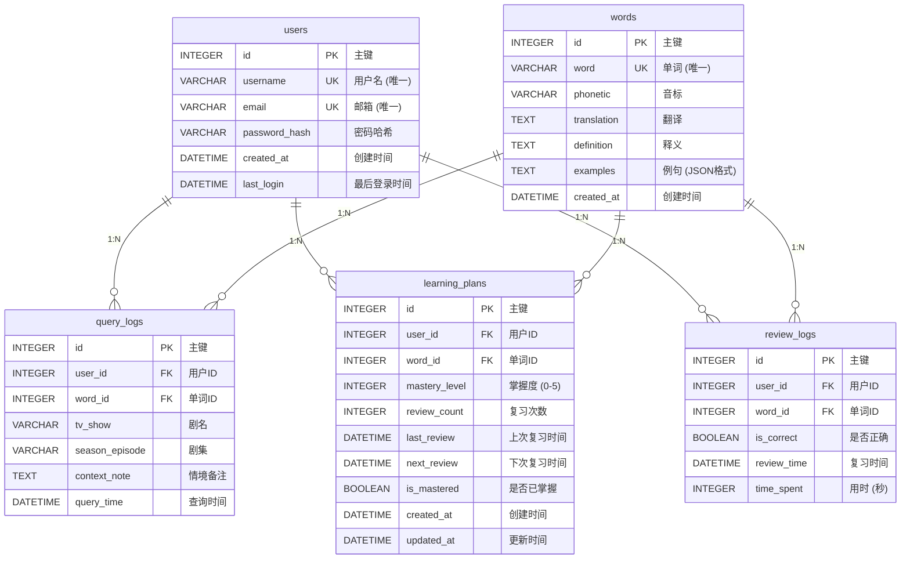

**图4-1：数据库E-R关系图**

### 4.2 核心数据表设计

#### 4.2.1 users（用户表）

| 字段名 | 数据类型 | 约束 | 说明 |
|--------|----------|------|------|
| id | INTEGER | PRIMARY KEY | 主键，自增 |
| username | VARCHAR(80) | UNIQUE, NOT NULL, INDEX | 用户名，唯一索引 |
| email | VARCHAR(120) | UNIQUE, NOT NULL, INDEX | 邮箱，唯一索引 |
| password_hash | VARCHAR(255) | NOT NULL | 密码哈希值（SHA256） |
| created_at | DATETIME | DEFAULT utcnow | 注册时间 |
| last_login | DATETIME | NULLABLE | 最后登录时间 |

**关系：**
- `query_logs`：一对多（一个用户可以有多条查询记录）
- `learning_plans`：一对多（一个用户可以有多个学习计划）
- `review_logs`：一对多（一个用户可以有多条复习记录）

#### 4.2.2 words（单词表）

| 字段名 | 数据类型 | 约束 | 说明 |
|--------|----------|------|------|
| id | INTEGER | PRIMARY KEY | 主键，自增 |
| word | VARCHAR(100) | UNIQUE, NOT NULL, INDEX | 单词文本，唯一索引 |
| phonetic | VARCHAR(100) | NULLABLE | 音标 |
| translation | TEXT | NULLABLE | 翻译（中文） |
| definition | TEXT | NULLABLE | 英文释义 |
| examples | TEXT | NULLABLE | 例句（JSON数组格式） |
| created_at | DATETIME | DEFAULT utcnow | 首次添加时间 |

**设计说明：**
- `word` 字段使用唯一索引，确保同一个单词在系统中只存在一条记录
- `examples` 字段存储JSON格式的例句数组，便于前端解析和展示
- 单词数据为全局共享，不与用户关联

#### 4.2.3 query_logs（查询记录表）

| 字段名 | 数据类型 | 约束 | 说明 |
|--------|----------|------|------|
| id | INTEGER | PRIMARY KEY | 主键，自增 |
| user_id | INTEGER | FOREIGN KEY, NOT NULL, INDEX | 用户ID，外键关联users.id |
| word_id | INTEGER | FOREIGN KEY, NOT NULL, INDEX | 单词ID，外键关联words.id |
| tv_show | VARCHAR(200) | NULLABLE | 剧集名称 |
| season_episode | VARCHAR(50) | NULLABLE | 季数集数（如：S01E05） |
| context_note | TEXT | NULLABLE | 情境备注 |
| query_time | DATETIME | DEFAULT utcnow, INDEX | 查询时间，索引 |

**设计说明：**
- 记录用户每次查询单词的详细信息
- 支持关联剧集场景，增强情境记忆
- `user_id` 和 `word_id` 建立联合索引，优化查询性能

#### 4.2.4 learning_plans（学习计划表）

| 字段名 | 数据类型 | 约束 | 说明 |
|--------|----------|------|------|
| id | INTEGER | PRIMARY KEY | 主键，自增 |
| user_id | INTEGER | FOREIGN KEY, NOT NULL, INDEX | 用户ID |
| word_id | INTEGER | FOREIGN KEY, NOT NULL, INDEX | 单词ID |
| mastery_level | INTEGER | DEFAULT 0 | 掌握度（0-5级） |
| review_count | INTEGER | DEFAULT 0 | 复习次数 |
| last_review | DATETIME | NULLABLE | 上次复习时间 |
| next_review | DATETIME | DEFAULT utcnow, INDEX | 下次复习时间，索引 |
| is_mastered | BOOLEAN | DEFAULT False, INDEX | 是否已掌握，索引 |
| created_at | DATETIME | DEFAULT utcnow | 创建时间 |
| updated_at | DATETIME | DEFAULT utcnow, onupdate | 更新时间，自动更新 |

**唯一约束：**
- `(user_id, word_id)` 联合唯一约束，确保每个用户的每个单词只有一个学习计划

**设计说明：**
- `mastery_level` 范围0-5，分别对应不同的复习间隔
- `next_review` 字段建立索引，优化查询今日待复习单词的性能
- `is_mastered` 字段建立索引，快速筛选已掌握和学习中的单词

#### 4.2.5 review_logs（复习记录表）

| 字段名 | 数据类型 | 约束 | 说明 |
|--------|----------|------|------|
| id | INTEGER | PRIMARY KEY | 主键，自增 |
| user_id | INTEGER | FOREIGN KEY, NOT NULL, INDEX | 用户ID |
| word_id | INTEGER | FOREIGN KEY, NOT NULL, INDEX | 单词ID |
| is_correct | BOOLEAN | NOT NULL | 是否答对 |
| review_time | DATETIME | DEFAULT utcnow, INDEX | 复习时间，索引 |
| time_spent | INTEGER | NULLABLE | 答题用时（秒） |

**设计说明：**
- 记录用户每次复习的详细数据，用于统计分析
- 可扩展用于生成学习报告和进步曲线
- `review_time` 索引支持按时间范围查询复习记录

### 4.3 数据库索引设计

为优化查询性能，系统在以下字段建立索引：

| 表名 | 索引字段 | 索引类型 | 用途 |
|------|----------|----------|------|
| users | username | UNIQUE | 用户登录查询 |
| users | email | UNIQUE | 邮箱登录查询 |
| words | word | UNIQUE | 单词查询 |
| query_logs | user_id | INDEX | 查询用户的单词记录 |
| query_logs | word_id | INDEX | 查询单词的查询历史 |
| query_logs | query_time | INDEX | 按时间排序 |
| learning_plans | user_id | INDEX | 查询用户学习计划 |
| learning_plans | word_id | INDEX | 查询单词学习计划 |
| learning_plans | next_review | INDEX | 查询待复习单词 |
| learning_plans | is_mastered | INDEX | 筛选掌握状态 |
| learning_plans | (user_id, word_id) | UNIQUE | 防止重复学习计划 |
| review_logs | user_id | INDEX | 查询用户复习记录 |
| review_logs | word_id | INDEX | 查询单词复习记录 |
| review_logs | review_time | INDEX | 按时间统计 |

---

## 5. 核心业务流程设计

### 5.1 用户注册与登录流程

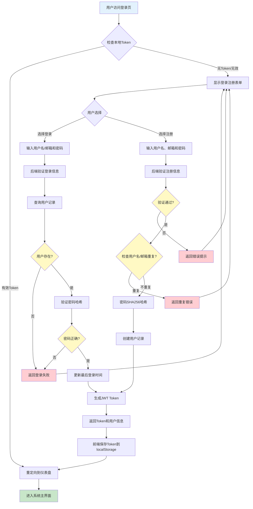

**图5-1：用户注册与登录流程图**

### 5.2 单词查询与自动记录流程

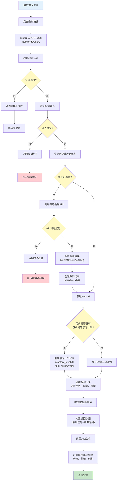

**图5-2：单词查询与自动记录流程图**

### 5.3 学习计划与复习流程

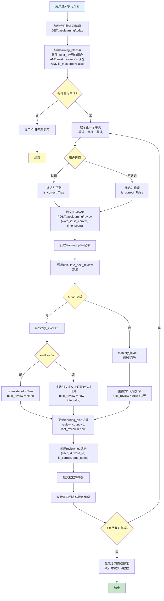

**图5-3：学习计划与复习流程图**

### 5.4 AI助手调用流程

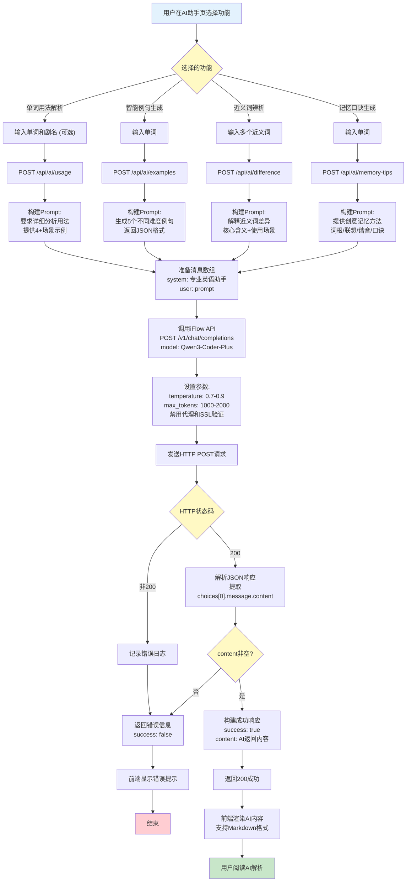

**图5-4：AI助手调用流程图**

---

## 6. 接口设计

### 6.1 API接口规范

**通用规范：**
- **协议：** HTTP/HTTPS
- **数据格式：** JSON
- **编码：** UTF-8
- **认证方式：** JWT Bearer Token（除登录和注册接口外，其他接口均需在请求头携带Token）
- **请求头：** `Authorization: Bearer <token>`、`Content-Type: application/json`

**统一响应格式：**

成功响应：
```json
{
  "code": 200,
  "data": {
    // 业务数据
  },
  "message": "操作成功" // 可选
}
```

错误响应：
```json
{
  "code": 400/401/404/500,
  "error": "error_type",
  "message": "错误描述信息"
}
```

**状态码约定：**
- `200`：请求成功
- `201`：创建成功（注册）
- `400`：请求参数错误
- `401`：未授权（未登录或Token失效）
- `404`：资源不存在
- `409`：资源冲突（用户名或邮箱已存在）
- `500`：服务器内部错误

### 6.2 认证模块接口

#### 6.2.1 用户注册

**接口地址：** `POST /api/auth/register`
**是否需要认证：** 否

**请求参数：**
```json
{
  "username": "testuser",
  "email": "test@example.com",
  "password": "password123"
}
```

**参数说明：**
- `username`（必填）：用户名，3-80字符
- `email`（必填）：邮箱，需符合邮箱格式
- `password`（必填）：密码，至少6字符

**成功响应：**
```json
{
  "code": 201,
  "message": "注册成功",
  "user": {
    "id": 1,
    "username": "testuser",
    "email": "test@example.com",
    "created_at": "2024-01-01T00:00:00.000Z"
  },
  "token": "eyJhbGciOiJIUzI1NiIsInR5cCI6IkpXVCJ9..."
}
```

**错误响应示例：**
```json
{
  "code": 409,
  "error": "Username exists",
  "message": "用户名已存在"
}
```

#### 6.2.2 用户登录

**接口地址：** `POST /api/auth/login`
**是否需要认证：** 否

**请求参数：**
```json
{
  "username": "testuser",  // 支持用户名或邮箱
  "password": "password123"
}
```

**成功响应：**
```json
{
  "code": 200,
  "message": "登录成功",
  "user": {
    "id": 1,
    "username": "testuser",
    "email": "test@example.com",
    "last_login": "2024-01-01T10:00:00.000Z"
  },
  "token": "eyJhbGciOiJIUzI1NiIsInR5cCI6IkpXVCJ9..."
}
```

**错误响应示例：**
```json
{
  "code": 401,
  "error": "Invalid credentials",
  "message": "用户名或密码错误"
}
```

#### 6.2.3 获取当前用户信息

**接口地址：** `GET /api/auth/me`
**是否需要认证：** 是

**请求头：**
```
Authorization: Bearer <token>
```

**成功响应：**
```json
{
  "code": 200,
  "user": {
    "id": 1,
    "username": "testuser",
    "email": "test@example.com",
    "created_at": "2024-01-01T00:00:00.000Z",
    "last_login": "2024-01-01T10:00:00.000Z"
  }
}
```

### 6.3 单词管理模块接口

#### 6.3.1 查询单词并自动记录

**接口地址：** `POST /api/words/query`
**是否需要认证：** 是

**请求参数：**
```json
{
  "word": "sarcastic",
  "tv_show": "Friends",          // 可选
  "season_episode": "S01E05",    // 可选
  "context_note": "Chandler的台词" // 可选
}
```

**成功响应：**
```json
{
  "code": 200,
  "data": {
    "id": 10,
    "word": "sarcastic",
    "phonetic": "/sɑːrˈkæstɪk/",
    "translation": "讽刺的；挖苦的",
    "definition": "using or characterized by irony in order to mock or convey contempt",
    "examples": [
      "She made a sarcastic comment about his cooking.",
      "Don't be so sarcastic!"
    ],
    "created_at": "2024-01-01T10:00:00.000Z",
    "query_count": 1,
    "last_query": "2024-01-01T10:00:00.000Z"
  }
}
```

**业务逻辑：**
1. 检查数据库是否已存在该单词
2. 如不存在，调用有道翻译API获取释义
3. 保存单词到`words`表
4. 检查用户是否已有该单词的学习计划，如没有则创建
5. 创建查询记录到`query_logs`表

#### 6.3.2 获取单词列表

**接口地址：** `GET /api/words/list`
**是否需要认证：** 是

**请求参数（URL Query）：**
- `page`（可选，默认1）：页码
- `page_size`（可选，默认20）：每页数量
- `order_by`（可选，默认time）：排序方式（time/frequency/mastery）
- `filter_show`（可选）：按剧集名称筛选
- `mastery_level`（可选）：按掌握度筛选（0-5）

**请求示例：**
```
GET /api/words/list?page=1&page_size=20&order_by=frequency&mastery_level=2
```

**成功响应：**
```json
{
  "code": 200,
  "data": {
    "total": 150,
    "page": 1,
    "page_size": 20,
    "items": [
      {
        "id": 10,
        "word": "sarcastic",
        "phonetic": "/sɑːrˈkæstɪk/",
        "translation": "讽刺的；挖苦的",
        "mastery_level": 2,
        "query_count": 5,
        "last_query": "2024-01-01T10:00:00.000Z",
        "tv_shows": ["Friends", "The Big Bang Theory"]
      }
      // ... 更多单词
    ]
  }
}
```

#### 6.3.3 导出单词本

**接口地址：** `GET /api/words/export`
**是否需要认证：** 是

**请求参数：**
- `format`（必填）：导出格式（excel 或 pdf）

**请求示例：**
```
GET /api/words/export?format=excel
```

**成功响应：**
- 返回文件流，浏览器自动下载
- Content-Type: `application/vnd.openxmlformats-officedocument.spreadsheetml.sheet`（Excel）
- Content-Type: `application/pdf`（PDF）
- 文件名格式：`单词本_用户名_20240101_100000.xlsx`

**导出内容包括：**
- 单词、音标、翻译、释义
- 例句列表
- 查询次数、掌握度、最后查询时间
- 用户信息（用户名、邮箱）

### 6.4 学习计划模块接口

#### 6.4.1 获取今日待复习单词

**接口地址：** `GET /api/learning/today`
**是否需要认证：** 是

**成功响应：**
```json
{
  "code": 200,
  "data": {
    "count": 8,
    "words": [
      {
        "id": 10,
        "word": "sarcastic",
        "phonetic": "/sɑːrˈkæstɪk/",
        "translation": "讽刺的；挖苦的",
        "learning_plan": {
          "mastery_level": 2,
          "review_count": 3,
          "last_review": "2023-12-29T10:00:00.000Z",
          "next_review": "2024-01-01T10:00:00.000Z",
          "is_mastered": false
        }
      }
      // ... 更多单词
    ]
  }
}
```

#### 6.4.2 提交复习结果

**接口地址：** `POST /api/learning/review`
**是否需要认证：** 是

**请求参数：**
```json
{
  "word_id": 10,
  "is_correct": true,
  "time_spent": 5  // 秒
}
```

**成功响应：**
```json
{
  "code": 200,
  "message": "复习结果已提交",
  "data": {
    "mastery_level": 3,
    "review_count": 4,
    "last_review": "2024-01-01T10:05:00.000Z",
    "next_review": "2024-01-08T10:05:00.000Z",
    "is_mastered": false
  }
}
```

**业务逻辑：**
1. 获取该用户的学习计划记录
2. 调用 `calculate_next_review(is_correct)` 方法计算新的掌握度和下次复习时间
3. 创建复习记录到 `review_logs` 表
4. 返回更新后的学习计划

### 6.5 AI助手模块接口

#### 6.5.1 单词用法解析

**接口地址：** `POST /api/ai/usage`
**是否需要认证：** 是

**请求参数：**
```json
{
  "word": "sarcastic",
  "tv_show": "Friends"  // 可选
}
```

**成功响应：**
```json
{
  "code": 200,
  "data": {
    "success": true,
    "word": "sarcastic",
    "tv_show": "Friends",
    "content": "# sarcastic 详细用法解析\n\n这个词主要用于描述一种讽刺、挖苦的说话方式...\n\n## 场景1：Chandler的经典讽刺风格\n...",
    "model": "Qwen3-Coder-Plus"
  }
}
```

**响应说明：**
- `content` 字段包含Markdown格式的AI生成内容
- 内容包括：核心含义概括、4+场景用法示例、小结、延伸问题

#### 6.5.2 智能例句生成

**接口地址：** `POST /api/ai/examples`
**是否需要认证：** 是

**请求参数：**
```json
{
  "word": "sarcastic",
  "count": 5  // 可选，默认5
}
```

**成功响应：**
```json
{
  "code": 200,
  "data": {
    "success": true,
    "word": "sarcastic",
    "examples": [
      {
        "sentence": "Don't be so sarcastic!",
        "translation": "别这么挖苦人！",
        "scenario": "日常对话中的劝告",
        "level": "beginner"
      },
      {
        "sentence": "His sarcastic remark hurt her feelings.",
        "translation": "他的讽刺言论伤害了她的感情。",
        "scenario": "描述他人言行",
        "level": "intermediate"
      }
      // ... 更多例句
    ]
  }
}
```

### 6.6 统计分析模块接口

#### 6.6.1 学习统计概览

**接口地址：** `GET /api/statistics/overview`
**是否需要认证：** 是

**成功响应：**
```json
{
  "code": 200,
  "data": {
    "total_words": 150,
    "today_queries": 12,
    "mastered_words": 45,
    "learning_words": 105,
    "to_review_words": 8,
    "query_trend": [
      {"date": "2024-01-01", "count": 12},
      {"date": "2024-01-02", "count": 8}
      // 最近7天数据
    ]
  }
}
```

#### 6.6.2 剧集单词排行

**接口地址：** `GET /api/statistics/tv_shows`
**是否需要认证：** 是

**成功响应：**
```json
{
  "code": 200,
  "data": [
    {"tv_show": "Friends", "word_count": 45},
    {"tv_show": "The Big Bang Theory", "word_count": 38},
    {"tv_show": "Game of Thrones", "word_count": 32}
    // Top 10
  ]
}
```

### 6.7 接口错误处理机制

所有接口在发生异常时，遵循以下错误处理流程：

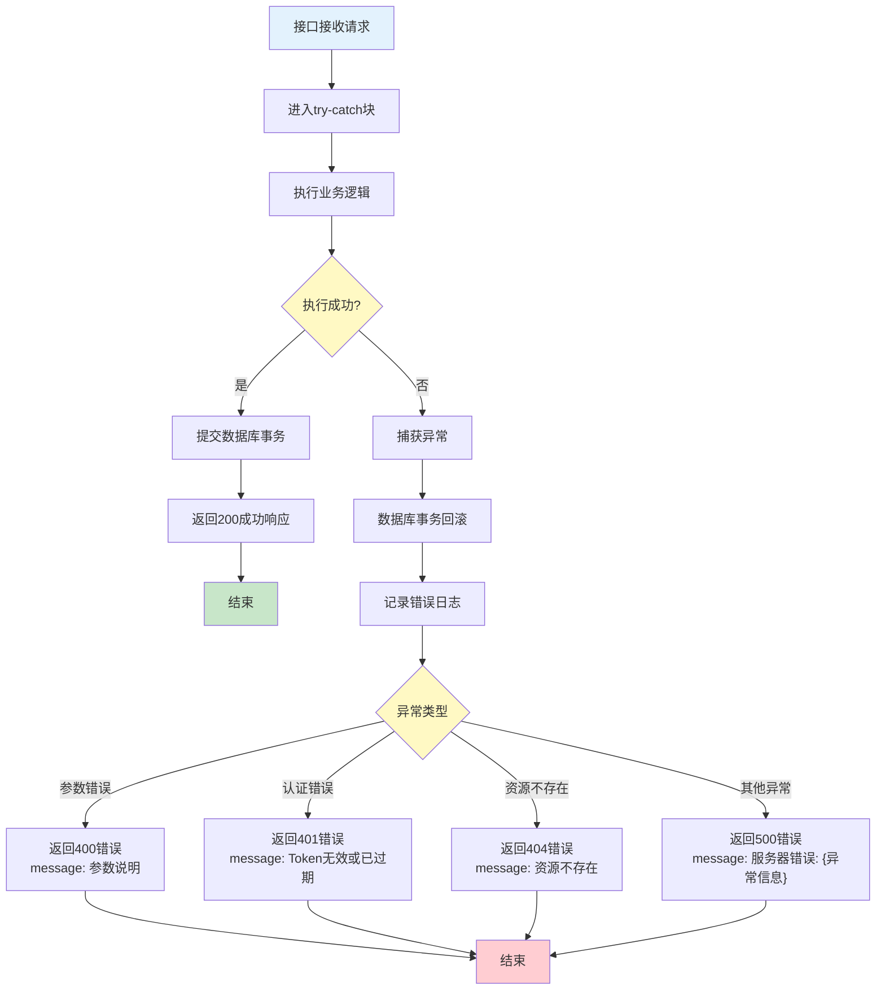

**图6-1：接口错误处理流程图**

**异常处理策略：**
1. **数据库操作异常：** 自动回滚事务，防止脏数据
2. **外部API调用失败：** 返回友好错误提示，必要时使用降级方案（如翻译API失败时使用模拟数据）
3. **认证异常：** 清除前端Token，跳转登录页
4. **所有异常均记录到控制台日志，便于问题排查**

---

## 7. 异常处理设计

### 7.1 异常分类与处理策略

系统将异常分为四大类，并针对每一类制定了明确的处理策略：

#### 7.1.1 用户输入异常

**异常来源：**
- 用户注册/登录时输入非法字符
- 单词查询时输入空字符串或超长字符串
- API请求参数缺失或类型错误

**处理策略：**
- 前端进行第一层验证（正则表达式、长度限制）
- 后端进行二次验证，返回400错误和详细的错误提示
- 不记录到错误日志，避免日志污染

**验证规则：**
- 用户名：3-80字符，仅允许字母、数字、下划线
- 邮箱：标准邮箱格式正则验证
- 密码：至少6字符
- 单词：1-100字符，非空字符串

#### 7.1.2 认证与权限异常

**异常来源：**
- 用户未登录访问受保护接口
- JWT Token过期或被篡改
- 用户尝试访问其他用户的数据

**处理策略：**
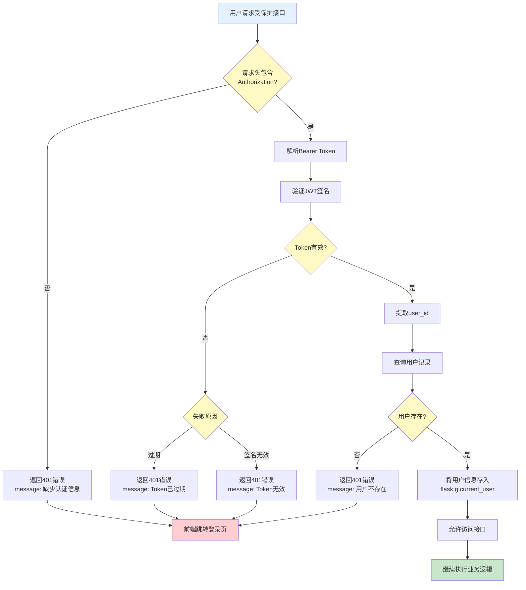

**图7-1：认证异常处理流程图**

**关键实现：**
- 使用 `login_required` 装饰器统一处理认证逻辑
- JWT有效期24小时，前端在过期前可通过 `/api/auth/refresh` 刷新Token
- 所有需要认证的接口在路由层面添加装饰器，确保零遗漏

#### 7.1.3 业务逻辑异常

**异常来源：**
- 单词查询时翻译API调用失败
- AI助手服务不可用或超时
- 导出功能依赖库未安装
- 学习计划不存在但用户尝试提交复习结果

**处理策略：**

**（1）翻译API异常处理：**
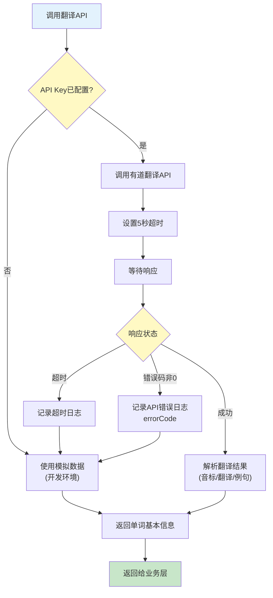

**图7-2：翻译API异常处理流程图**

**降级方案：**
- 如果有道API不可用，使用预设的模拟数据返回
- 模拟数据包含基本的音标和翻译信息
- 在控制台输出警告日志，提醒开发者API配置问题

**（2）AI助手异常处理：**
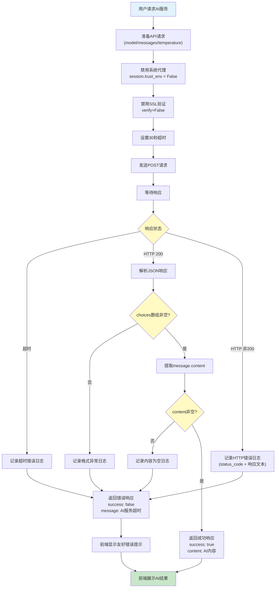

**图7-3：AI助手异常处理流程图**

**重要说明：**
- AI服务调用禁用SSL验证是为了解决开发环境代理冲突问题
- 生产环境部署时应重新启用SSL验证以确保安全性
- 超时时间设置为30秒，因为AI生成内容需要10-15秒
- 所有异常都返回友好的中文错误提示，不暴露技术细节

**（3）导出功能异常处理：**
```python
# 依赖检测机制
def check_dependencies():
    dependencies = {
        'excel': False,
        'pdf': False
    }

    try:
        import openpyxl
        dependencies['excel'] = True
    except ImportError:
        pass

    try:
        import reportlab
        dependencies['pdf'] = True
    except ImportError:
        pass

    return dependencies

# 导出接口调用前检测
dependencies = export_service.check_dependencies()
if format == 'excel' and not dependencies['excel']:
    return error_response(500, 'Excel导出功能未配置，请安装openpyxl库')
```

**容错机制：**
- 系统启动时不强制检查导出库是否安装
- 用户点击导出时实时检测依赖可用性
- 如果依赖缺失，返回明确的错误提示和安装指导

#### 7.1.4 数据库异常

**异常来源：**
- 数据库连接失败
- 外键约束冲突
- 唯一性约束冲突（用户名/邮箱重复）
- 事务执行失败

**处理策略：**
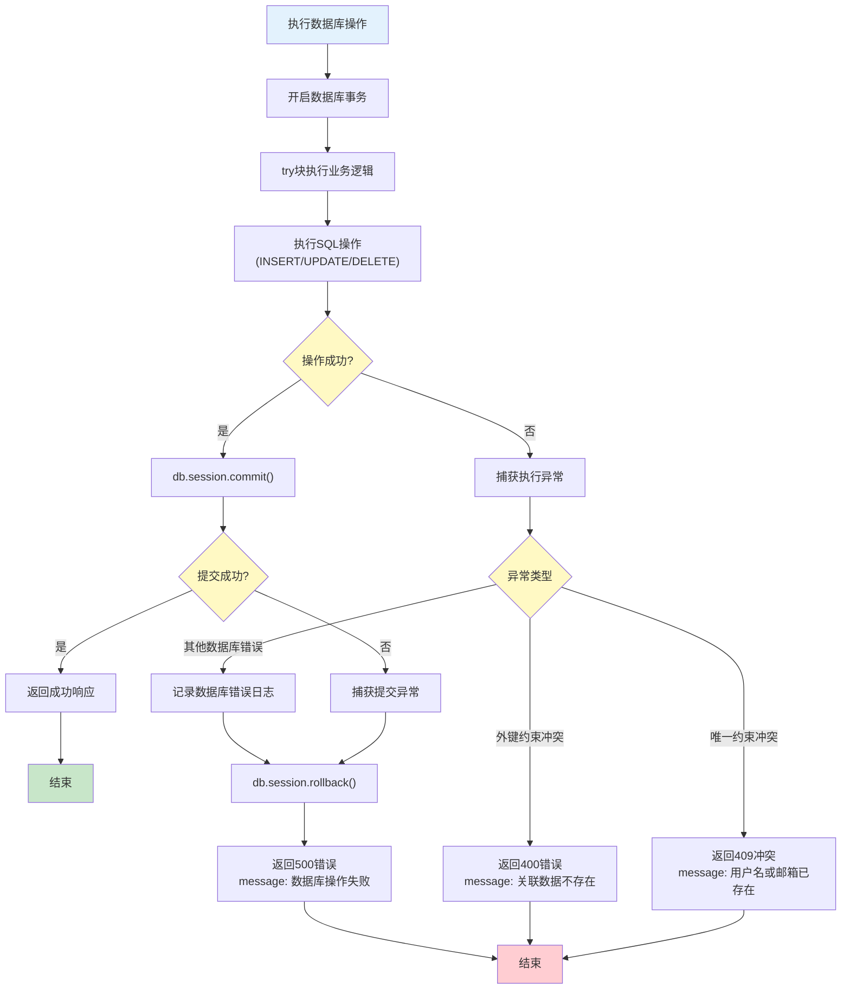

**图7-4：数据库异常处理流程图**

**关键机制：**
- **事务回滚：** 所有数据库操作失败后立即调用 `db.session.rollback()`，确保数据一致性
- **唯一约束处理：** 捕获 `IntegrityError` 异常，返回409冲突状态码
- **连接池管理：** Flask-SQLAlchemy自动管理连接池，无需手动释放连接

### 7.2 全局异常处理机制

**Flask全局异常捕获：**
```python
# 在app/__init__.py中注册全局错误处理器
@app.errorhandler(Exception)
def handle_exception(e):
    """全局异常处理器"""
    # 记录异常详情
    app.logger.error(f"Unhandled exception: {str(e)}", exc_info=True)

    # 数据库回滚
    db.session.rollback()

    # 返回统一错误响应
    return jsonify({
        'code': 500,
        'error': 'Internal Server Error',
        'message': '服务器内部错误，请稍后重试'
    }), 500
```

**前端全局异常拦截：**
```javascript
// Axios响应拦截器（frontend/src/utils/request.js）
axiosInstance.interceptors.response.use(
  response => response.data,
  error => {
    if (error.response) {
      const status = error.response.status;
      const message = error.response.data?.message || '请求失败';

      switch (status) {
        case 401:
          // Token失效，清除本地存储，跳转登录页
          localStorage.removeItem('token');
          router.push('/login');
          break;
        case 400:
          // 显示参数错误提示
          showErrorToast(message);
          break;
        case 500:
          // 显示服务器错误提示
          showErrorToast('服务器错误，请稍后重试');
          break;
        default:
          showErrorToast(message);
      }
    } else if (error.request) {
      // 网络错误
      showErrorToast('网络连接失败，请检查网络设置');
    }

    return Promise.reject(error);
  }
);
```

### 7.3 异常监控与日志记录

**日志记录策略：**
1. **控制台日志：** 开发环境下输出详细的调试信息
2. **错误日志：** 记录所有500错误和外部API调用失败
3. **访问日志：** 记录所有API请求的路径、方法、状态码和响应时间

**日志格式示例：**
```
[2024-01-01 10:00:00] INFO - User login: username=testuser, ip=192.168.1.100
[2024-01-01 10:05:30] ERROR - Youdao API failed: errorCode=401, message=Invalid credentials
[2024-01-01 10:10:15] WARNING - AI API timeout after 30 seconds: word=sarcastic
```

**异常恢复机制：**
- **翻译API失败：** 自动降级到模拟数据
- **AI服务失败：** 提示用户稍后重试，不影响其他功能
- **数据库连接失败：** 返回503服务不可用，建议用户刷新页面
- **导出功能失败：** 提示用户检查依赖安装，提供文档链接

---

## 附录

### 附录A：技术术语表

| 术语 | 英文全称 | 说明 |
|------|----------|------|
| JWT | JSON Web Token | 基于JSON的无状态身份认证令牌 |
| REST | Representational State Transfer | 表述性状态转移，一种API设计风格 |
| ORM | Object-Relational Mapping | 对象关系映射，用于在对象和数据库之间转换数据 |
| CORS | Cross-Origin Resource Sharing | 跨域资源共享 |
| SPA | Single Page Application | 单页应用 |
| WSGI | Web Server Gateway Interface | Python Web服务器网关接口 |
| SHA256 | Secure Hash Algorithm 256-bit | 安全哈希算法256位 |
| ER图 | Entity-Relationship Diagram | 实体关系图 |

### 附录B：源代码文件清单

**后端核心文件：**
```
backend/
├── app/
│   ├── __init__.py              # Flask应用工厂，初始化数据库和CORS
│   ├── models/
│   │   ├── user.py              # User模型类
│   │   ├── word.py              # Word模型类
│   │   ├── query_log.py         # QueryLog模型类
│   │   ├── learning_plan.py     # LearningPlan模型类（包含艾宾浩斯算法）
│   │   └── review_log.py        # ReviewLog模型类
│   ├── routes/
│   │   ├── auth.py              # 认证路由（注册/登录）
│   │   ├── words.py             # 单词管理路由
│   │   ├── learning.py          # 学习计划路由
│   │   ├── statistics.py        # 统计分析路由
│   │   └── ai.py                # AI助手路由
│   ├── services/
│   │   ├── translation_service.py  # 翻译服务（有道API封装）
│   │   ├── ai_service.py           # AI服务（iFlow API封装）
│   │   └── export_service.py       # 导出服务（Excel/PDF生成）
│   └── utils/
│       └── auth.py              # JWT工具函数和装饰器
├── config.py                    # 配置类（开发/生产环境）
├── run.py                       # 应用启动入口
└── requirements.txt             # Python依赖列表
```

**前端核心文件：**
```
frontend/
├── src/
│   ├── main.js                  # Vue应用入口
│   ├── App.vue                  # 根组件
│   ├── layouts/
│   │   └── AppLayout.vue        # 主布局组件（导航+内容区）
│   ├── views/
│   │   ├── LoginView.vue        # 登录注册页
│   │   ├── DashboardView.vue    # 仪表盘（首页）
│   │   ├── LibraryView.vue      # 单词库页面
│   │   ├── WordDetailView.vue   # 单词详情页
│   │   ├── LearningView.vue     # 学习复习页
│   │   └── AIView.vue           # AI助手页
│   ├── components/
│   │   └── TopNavigation.vue    # 顶部导航栏组件
│   ├── router/
│   │   └── index.js             # 路由配置（含路由守卫）
│   ├── stores/
│   │   └── auth.js              # 认证状态管理（Pinia）
│   └── utils/
│       └── request.js           # Axios封装和拦截器
├── index.html                   # HTML入口文件
├── vite.config.js               # Vite构建配置
├── tailwind.config.js           # Tailwind CSS配置
└── package.json                 # npm依赖配置
```

### 附录C：环境配置说明

**后端环境变量（.env文件）：**
```bash
# Flask配置
SECRET_KEY=your-secret-key-here-change-in-production
FLASK_ENV=production

# 数据库配置
DATABASE_URL=sqlite:///vocab_learner.db

# 有道翻译API
YOUDAO_APP_KEY=your_app_key_here
YOUDAO_APP_SECRET=your_app_secret_here

# CORS跨域配置
CORS_ORIGINS=http://localhost:5173,https://your-frontend-domain.com

# 端口配置
PORT=5000
```

**AI配置（ai_config.json）：**
```json
{
  "provider": "iFlow",
  "base_url": "https://apis.iflow.cn/v1",
  "endpoint": "https://apis.iflow.cn/v1/chat/completions",
  "api_key": "your_iflow_api_key_here",
  "model": "Qwen3-Coder-Plus"
}
```

### 附录D：部署说明

**开发环境启动：**
```bash
# 后端
cd backend
pip install -r requirements.txt
python run.py

# 前端
cd frontend
npm install
npm run dev
```

**生产环境部署：**

1. **后端部署（Railway平台）：**
   - 连接GitHub仓库
   - 设置环境变量（SECRET_KEY、YOUDAO_APP_KEY等）
   - 使用Gunicorn作为WSGI服务器：`gunicorn run:app`
   - 数据库使用Railway的持久化存储

2. **前端部署（Vercel平台）：**
   - 导入GitHub仓库
   - 构建命令：`npm run build`
   - 输出目录：`dist`
   - 环境变量：`VITE_API_BASE_URL`（指向后端API地址）

3. **CORS配置：**
   - 后端`.env`文件的`CORS_ORIGINS`需添加前端部署域名
   - 确保前端请求携带正确的`Authorization`头

---

**文档版本：** V1.0
**最后更新日期：** 2025年11月
**编制人：** 系统开发团队
**审核人：** 技术负责人

---

**本文档为《美剧单词学习助手系统》的完整软件设计说明书，符合中国版权保护中心（CPCC）软件著作权申请的技术文档要求。文档基于实际源代码编写，所有架构图、流程图、数据库设计图均使用Mermaid语法规范绘制，确保准确性和可读性。**
